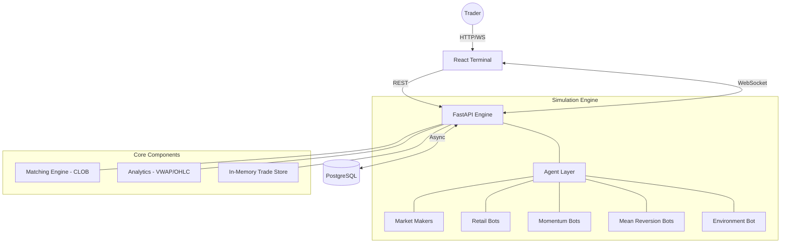

# 🇮🇳 India Exchange Sim

[](https://fastapi.tiangolo.com/)
[](https://reactjs.org/)
[](https://www.postgresql.org/)
[](https://www.docker.com/)

A high-performance, full-stack trading exchange simulator tailored for the Indian equity market (NSE). This project features a sub-millisecond matching engine, realistic agent-based market simulation, and a premium trading terminal.

---

## ✨ Key Features

### ⚡ High-Performance Matching Engine

- **CLOB Architecture:** Central Limit Order Book with price-time priority.
- **NSE Microstructure:** Supports **Disclosed Quantity (Iceberg)** orders, Market/Limit types, and tick-level precision.
- **Asynchronous Core:** Built with FastAPI and `asyncio` for non-blocking order routing and broadcasts.

### 🤖 Advanced Market Simulation

- **Market Makers:** Maintain liquidity with dynamic bid/ask ladders and volatility-adjusted spreads.
- **Retail Bots:** Simulate organic "noise" with random aggression and reaction delays.
- **Momentum Agents:** Trend-following bots that capitalize on price breakouts.
- **Mean Reversionists:** Intelligent agents tracking VWAP to identify and trade price over-extensions.
- **Macro Dynamics:** Panic/Greed cascades and correlated sector-based movements (e.g., IT, Banking).

### 📊 Premium Trading Terminal

- **Real-time Charts:** 1-minute OHLCV candlestick charts via TradingView Lightweight Charts.
- **Live Market Watch:** Instant LTP updates and percentage changes for NIFTY 50 top scrips.
- **Depth & Analytics:** Visual market depth (L2) and real-time VWAP calculation.
- **Portfolio Management:** Live tracking of positions, cost basis, realized profit, and floating P&L.

---

## 🏛️ Architecture



---

## 🚀 Getting Started

### Method 1: Docker (Recommended)

Launch the entire ecosystem with a single command:

```bash
docker compose up -d
```

- **Frontend:** [http://localhost:5173](http://localhost:5173)
- **API Docs:** [http://localhost:8000/docs](http://localhost:8000/docs)
- **Postgres:** `localhost:5432` (user: `exchange_user`, pass: `exchange_pass`)

### Method 2: Manual Development

If you prefer running services outside Docker:

**1. Database:**

```bash
docker compose up -d db
```

**2. Backend (Engine):**

```bash
cd apps/engine
python -m venv .venv
source .venv/bin/activate # Windows: .venv\Scripts\activate
pip install -r requirements.txt
uvicorn main:app --reload
```

**3. Frontend (Web):**

```bash
cd apps/web
npm install
npm run dev
```

---

## 📂 Project Structure

```text
india-exchange-sim/
├── apps/
│   ├── engine/          # FastAPI Matcher + Simulation Bots
│   │   ├── core/        # CLOB, Order, Trade logic
│   │   ├── db/          # SQLAlchemy Models & Migrations
│   │   └── simulation/  # Agent personalities & events
│   └── web/             # React + Vite Frontend
│       ├── src/
│       │   ├── components/ # Trading UI Components
│       │   └── hooks/      # WebSocket & Data fetching
├── docker-compose.yml   # Full stack orchestration
└── plan.md              # Project roadmap & progress
```

---

## 🛠️ Technology Stack

- **Engine:** Python 3.12, FastAPI, SQLAlchemy (Async), Pydantic.
- **Database:** PostgreSQL 16.
- **Frontend:** React 18, TypeScript, Vite, TailwindCSS (for layout), TradingView Lightweight Charts.
- **Ops:** Docker, Docker Compose.

---

## 🛤️ Roadmap

- [x] **Phase 1:** Core Matching Engine & Basic Agents (MM, Retail, Momentum).
- [ ] **Phase 2:** Market Structure Realism (OHLCV Candles, VWAP, Circuit Breakers, Pre-open Auction).
- [ ] **Phase 3:** Real NSE Data Seeding (Bhavcopy CSVs) & Corporate Actions.
- [ ] **Phase 4:** Advanced Frontend (Market Depth Replay, Session Summaries).

---

## 📜 License

Distributed under the **MIT License**. See `LICENSE` for more information.

---

**Built with ❤️ for Indian Traders.**
