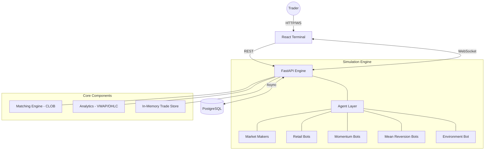

# 🇮🇳 India Exchange Sim

[](https://fastapi.tiangolo.com/)
[](https://reactjs.org/)
[](https://www.postgresql.org/)
[](https://www.docker.com/)

Welcome to the **India Exchange Sim**, a high-performance, full-stack trading exchange simulator tailored explicitly for the Indian equity market (NSE). 

This project goes beyond a simple mock exchange. It features a sub-millisecond matching engine, hyper-realistic agent-based market simulation, and a premium, responsive trading terminal. It is built to replicate the complex dynamics of a real trading day, offering genuine organic order flow generated by diverse AI personalities, accurate market microstructure (including call auctions and circuit breakers), and a professional-grade web interface.

Whether you are looking to understand market microstructures, test algorithmic trading strategies, or explore high-performance system design in Python and React, this simulator provides a robust, fully containerized sandbox environment.

---

## 🏛️ System Architecture

The simulator is built on a modern, decoupled architecture designed for high throughput and low latency.



### 1. The FastAPI Engine (Backend)
The backend is an asynchronous powerhouse built with Python's FastAPI. It handles routing orders, maintaining the order books, running the simulation agents, and broadcasting real-time market data.
- **In-Memory First**: All matching, agent logic, and short-term data aggregation occur entirely in memory to achieve sub-millisecond latencies. It implements a custom `TradeStore` acting as a fast circular buffer for O(1) recent trade access.
- **Async I/O Pipeline**: Built entirely on Python's `asyncio` for non-blocking operations, ensuring that heavy DB writes or thousands of WebSocket messages do not stall the core matching engine loop.

### 2. The React Terminal (Frontend)
A professional-grade trading terminal built with React 18, Vite, and TypeScript.
- **Master-Detail Grid Layout**: A unified grid system ensures maximum screen utilization. It uses a fixed docked layout, moving away from floating widgets to present a holistic, data-dense view of the market while allowing deep dives into specific scrips.
- **High-Performance Rendering Architecture**: Utilizes deeply nested `React.memo` boundaries, `useReducer` to coalesce state updates, and virtualized lists (via `react-window`) to handle thousands of updates per second without UI stutter or DOM bloat.

### 3. PostgreSQL Database
Acts as the persistent source of truth.
- **Advanced Indexing & Partitioning**: Implements time-based partitioning (`pg_partman` style) on the `price_history` table to prevent full-table scans. Employs composite indexes on `(scrip, timestamp DESC)` for heavily queried tables.
- **Buffered Writes**: To prevent synchronous write queuing under load, trades and orders are accumulated in memory and flushed to PostgreSQL in bulk (every 500ms) via dedicated background `asyncio` workers.

---

## ⚙️ Core Mechanics & Microstructure

To simulate the National Stock Exchange (NSE) accurately, the engine implements strict market microstructure rules and mathematical models:

- **Central Limit Order Book (CLOB)**: The heart of the exchange. It implements dual heaps: a **Max-Heap** for the Bid side (highest price first) and a **Min-Heap** for the Ask side (lowest price first). This structure mathematically guarantees strict **Price-Time Priority** matching in O(log N) time.
- **Tick & Lot Sizes**: Fully enforces real-world constraints. All 50 NIFTY constituent stocks are driven by a `scrip_metadata` configuration dictating accurate lot sizes and tick increments (e.g., ₹0.05). Orders violating these constraints are strictly rejected.
- **Disclosed Quantity (Iceberg Orders)**: Supports hidden volume mechanics. Agents and users can place large institutional orders where only a fraction of the total volume (`visible_qty`) is exposed to the public order book, regenerating upon execution.
- **Real-time VWAP Engine**: Calculates the Volume Weighted Average Price dynamically. The `TradeStore` maintains running variables for `cumulative_typical_price_volume` and `cumulative_volume` per scrip, computing a O(1) mathematical update on every single executed trade.
- **Pre-Open Call Auction (9:00–9:15 AM)**: A state machine controls the `MarketSession`. During `PRE_OPEN`, orders are accumulated but not matched. At market open, an **equilibrium price discovery algorithm** iterates through the overlapping bid-ask arrays to find the single price point that maximizes executable volume, executing all eligible trades simultaneously before transitioning to the `OPEN` state.
- **Circuit Breakers**: Implements strict ±20% daily price limits against the previous day's closing price. If a scrip breaches this mathematical limit, the engine triggers a `MarketHalt` state, rejecting new orders and pausing the respective active agents.
- **In-Memory OHLCV Aggregation**: A `CandleAggregator` buckets real-time trades into 1-minute intervals (Open, High, Low, Close, Volume) in memory, broadcasting live via WebSocket before a background task persists the finalized candle to the database.

---

## 🤖 Advanced Agent-Based Simulation

A static order book is useless. This simulator breathes life into the market using an asynchronous agent layer that generates continuous, organic order flow. Each agent operates independently based on a shared `BaseAgent` class and a highly tuned `AgentConfig`:

- **Market Makers**: The backbone of liquidity. They maintain dynamic bid/ask ladders. Their configuration allows them to mathematically scale their spread width and quoting volume dynamically based on recent market volatility (wider spreads in high volatility).
- **Retail Bots**: Simulates organic "noise" traders. They exhibit randomized aggression profiles, variable order sizes, and intentional `asyncio.sleep()` reaction delays, providing the chaotic baseline of daily trading.
- **Momentum Agents**: Trend-following algorithms. They parse the recent trades in the `TradeStore` to detect short-term price breakouts, aggressively submitting market orders to ride the momentum until the trend exhausts.
- **Mean Reversion Agents**: Contrarian algorithms relying heavily on the VWAP engine. They track real-time deviations from the VWAP. When a price becomes mathematically over-extended by a configured standard deviation, they fade the trend, placing limit orders assuming a reversion to the mean.
- **Macro Dynamics Engine**:
  - **Panic/Greed Cascades**: Monitors percentage moves. Sudden 1% directional moves trigger an environment cascade override, causing all agents to temporarily flood the market in that direction, simulating panic selling or FOMO buying.
  - **Correlated Sector Moves**: The metadata defines sector relationships (e.g., IT, Banking). If HDFCBANK surges by >0.5%, the engine applies a mathematical nudge to the order flow of sector peers like ICICIBANK, mimicking real-world index arbitrage and sector correlations.

---

## 🚀 Extreme Performance Optimizations

Handling 50 active order books with hundreds of bots firing orders simultaneously is a massive data pipeline. The project employs severe optimizations to maintain 60 FPS on the frontend:

1. **Server-Side WebSocket Batching**: Broadcasting every individual trade event destroys frontend performance. The engine implements a broadcast buffer—collecting all depth, trade, and candle events within a 100ms window and dispatching them as a single JSON array payload.
2. **Scrip-Specific Topic Routing**: Instead of broadcasting the entire market state globally, WebSockets are routed via topics (`depth.RELIANCE`, `candles.TCS`). The React frontend only subscribes to the high-frequency feeds of the currently active Master Scrip View, cutting network payload by 98%.
3. **Diff-Only Heartbeats & Throttling**: The Market Watch panel utilizes a `useThrottle` React hook to limit re-renders to 2 updates per second. Furthermore, the backend only broadcasts a scrip's Last Traded Price (LTP) if it has mathematically changed since the last tick.
4. **React `useReducer` State Coalescing**: Raw `useState` chains cause cascading re-renders upon receiving a batched WebSocket payload. The app utilizes a `useReducer` + `useMemo` pattern to process the entire WebSocket array in a single off-main-thread operation, triggering only one render cycle.
5. **Cold-Start Hydration API**: Instead of building up the initial UI state via a flood of WebSockets, the frontend makes a single HTTP GET request (`/api/snapshot/init`) on mount. This returns the entire initial state (LTP for all 50 scrips, top-5 depth for the active scrip, and the last 100 historical candles), rendering the terminal instantly.

---

## 📊 Premium Trading Terminal Features

The UI is designed to look and feel like a proprietary institutional trading platform:

- **TradingView Canvas Integration**: High-performance 1-minute OHLCV candlestick charts powered by TradingView Lightweight Charts. Uses `React.lazy` and `Suspense` for faster shell rendering.
- **Live Technical Indicators**: Real-time rendering of VWAP overlays, Volume Histograms, and EMA-9 / EMA-21 moving averages, updated dynamically via WebSocket.
- **Level 2 Market Depth**: A highly optimized DOM (Depth of Market) component. It displays live bids/asks out to 8 levels, enhanced with dynamic CSS visual depth gradients for split-second liquidity assessment.
- **Real-Time Portfolio Math**: Tracks positions dynamically. Calculates average entry cost basis, realized profits from closed positions, and mark-to-market (unrealized) floating P&L based on live tick data.
- **Virtual Order History & Trade Log**: Comprehensive history tables utilizing `react-window` to ensure smooth scrolling through thousands of rows. Features pagination, sorting, status badges (Filled, Partial, Canceled), and individual trade P&L tracking.

---

## 📈 Real Market Data Seeding

To ensure the simulation feels authentic from the very first second:
- A standalone Python script boots the system by fetching true end-of-day OHLCV data directly from Yahoo Finance for the entire NIFTY 50 universe.
- This data automatically seeds the PostgreSQL `price_history` tables and establishes the mathematical reference closing prices necessary for circuit breaker limits and agent baseline calculations before the engine even starts.

---

## 🚀 Getting Started

### Method 1: Docker (Recommended)

The easiest way to launch the entire ecosystem (Database, FastAPI Engine, React Frontend) is via Docker Compose.

```bash
# Clone the repository
git clone https://github.com/yourusername/india-exchange-sim.git
cd india-exchange-sim

# Launch all services in detached mode
docker compose up -d
```

Once the containers are running:
- **Frontend Trading Terminal:** [http://localhost:5173](http://localhost:5173)
- **FastAPI Engine API Docs:** [http://localhost:8000/docs](http://localhost:8000/docs)
- **PostgreSQL Database:** `localhost:5432` (user: `exchange_user`, pass: `exchange_pass`)

### Method 2: Manual Development Setup

If you prefer to run the services directly on your host machine for active development:

**1. Start the PostgreSQL Database:**
```bash
docker compose up -d db
```

**2. Setup & Run the Backend Engine:**
```bash
cd apps/engine

# Create and activate a virtual environment
python -m venv .venv
source .venv/bin/activate         # Linux/Mac
# .venv\Scripts\activate          # Windows

# Install dependencies
pip install -r requirements.txt

# Run the seeding utility (Downloads NIFTY 50 history)
python ../../data/seed_price_history.py

# Start the matching engine server
uvicorn main:app --reload
```

**3. Setup & Run the Frontend Terminal:**
```bash
# Open a new terminal window
cd apps/web

# Install dependencies
npm install

# Start the Vite development server
npm run dev
```

---

## 📂 Comprehensive Project Structure

```text
india-exchange-sim/
├── apps/
│   ├── engine/                # FastAPI Matcher + AI Simulation
│   │   ├── core/              # CLOB, Order logic, Matching Engine algorithms, Scrip Metadata
│   │   ├── db/                # SQLAlchemy Async Models, DB Initialization scripts
│   │   ├── routers/           # REST API endpoints (Orders, Portfolios, Admin)
│   │   └── simulation/        # Agent personalities, VWAP calculators, Session managers
│   └── web/                   # React + TypeScript Frontend
│       ├── src/
│       │   ├── components/    # Charting, OrderBook, OrderForm, Portfolio, MarketWatch
│       │   ├── hooks/         # Custom React hooks (useWebSocket, useThrottle)
│       │   ├── lib/           # Utility functions and API clients
│       │   ├── store/         # Global state management context
│       │   └── pages/         # Master Terminal Layout views
├── data/                      # Scripts for fetching historical Bhavcopy/Yahoo Finance data
├── docker-compose.yml         # Full stack orchestration configuration
├── plan.md                    # Project roadmap & granular progress tracking
└── README.md                  # This file
```

---

## 🛠️ Technology Stack Breakdown

### Backend Simulation Engine
- **Language:** Python 3.12+
- **Framework:** FastAPI
- **Database ORM:** SQLAlchemy (Async)
- **Data Validation:** Pydantic
- **Math/Analytics:** Pandas, NumPy
- **Concurrency:** Built entirely on Python's `asyncio` for non-blocking task execution.

### Database Layer
- **Engine:** PostgreSQL 16
- **Storage Strategy:** Persisted JSONB depth snapshots for fast retrieval; normalized relational Trade/Order logs for accurate historical queries.

### Frontend Interface
- **Framework:** React 18
- **Language:** TypeScript
- **Build Tool:** Vite
- **Styling:** CSS Modules & TailwindCSS for rapid, responsive layout mapping.
- **Charting Engine:** TradingView Lightweight Charts (Canvas-based rendering for ultra-fast performance).

---

## 📜 License

Distributed under the **MIT License**. See `LICENSE` for more information.

---

**Built with ❤️ for High-Frequency Engineers and Market Enthusiasts.**
