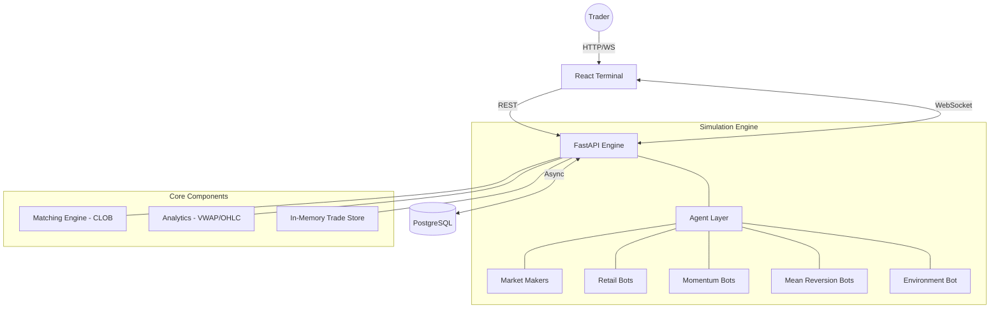

# 🇮🇳 India Exchange Sim

[](https://fastapi.tiangolo.com/)
[](https://reactjs.org/)
[](https://www.postgresql.org/)
[](https://www.docker.com/)

A high-performance, full-stack trading exchange simulator tailored for the Indian equity market (NSE). This project features a sub-millisecond matching engine, realistic agent-based market simulation, and a premium trading terminal. It is built to replicate the dynamics of a real trading day, offering genuine order flow from diverse AI personalities, correct market microstructure, and a professional web interface.

---

## ✨ Key Features

### ⚡ High-Performance Matching Engine
- **CLOB Architecture:** Central Limit Order Book with strict price-time priority.
- **NSE Microstructure:** Supports **Disclosed Quantity (Iceberg)** orders, Market/Limit types, and tick-level precision.
- **Circuit Breakers:** Strict ±20% daily limits against reference prices to halt extreme volatility.
- **Asynchronous Core:** Built with FastAPI and `asyncio` for non-blocking order routing, matching, and websocket broadcasts.

### 🤖 Advanced Agent-Based Market Simulation
The exchange is populated by highly tuned, asynchronous trading bots that generate organic, hyper-realistic order flow:
- **Market Makers:** Provide continuous liquidity with dynamic bid/ask ladders, scaling their spread and volume based on recent volatility.
- **Retail Bots:** Simulate organic "noise" with random aggression, variable order sizes, and delayed reactions.
- **Momentum Agents:** Trend-following algorithms that detect short-term price breakouts and pile in to ride the momentum.
- **Mean Reversion Agents:** Intelligent algorithms that track real-time VWAP deviations to identify over-extended prices and fade the trend.
- **Macro Dynamics:** The simulator includes logic for **Panic/Greed cascades** (where 1% moves trigger market flooding) and **Correlated Scrip Moves** (where IT or Banking peers are nudged by sectoral momentum).

### 📈 Real Market Data & Scale
- **NIFTY 50 Universe:** Fully configured to trade all 50 constituent stocks of the NIFTY 50 index (RELIANCE, TCS, HDFCBANK, etc.) with accurate lot sizes and tick sizes (₹0.05).
- **Historical Seed Data:** Bootstraps reference prices and initial states by downloading real end-of-day OHLCV data directly from Yahoo Finance, seeding the PostgreSQL database before the simulation starts.

### 📊 Premium Trading Terminal
- **Real-time Charting:** High-performance 1-minute OHLCV candlestick charts powered by TradingView Lightweight Charts with sub-second WebSocket hydration.
- **Advanced Indicators:** Live plotting of **VWAP (Volume Weighted Average Price)**, **Volume Histograms**, and **EMA-9 / EMA-21** overlays.
- **Live Market Watch:** Instant LTP updates, percentage changes, and session states for the entire NIFTY 50.
- **Level 2 Market Depth:** A highly optimized order book component displaying live bids/asks, visually enhanced with depth gradients for immediate liquidity assessment.
- **Portfolio Management:** Real-time tracking of positions, calculating cost basis, realized profits, and mark-to-market (unrealized) floating P&L.

---

## 🏛️ Architecture



### The Data Flow
1. **Agents & Users** construct and submit `Order` objects via REST or direct engine calls.
2. The **Matcher** routes the order to the correct `OrderBook`.
3. The **OrderBook** executes matches based on Price-Time Priority, generating `Trade` objects.
4. **Trades** are sent to the `TradeStore` (in-memory circular buffer) and simultaneously pushed to a background task for **PostgreSQL persistence**.
5. The **CandleAggregator** groups the latest trades into 1-minute OHLCV structures.
6. The **WebSocket Broadcaster** immediately publishes the new depth, trades, and candle data to the connected React frontend.

---

## 🚀 Getting Started

### Method 1: Docker (Recommended)

Launch the entire ecosystem (Database, FastAPI Engine, React Frontend) with a single command:

```bash
docker compose up -d
```

- **Frontend Terminal:** [http://localhost:5173](http://localhost:5173)
- **Engine API Docs:** [http://localhost:8000/docs](http://localhost:8000/docs)
- **PostgreSQL:** `localhost:5432` (user: `exchange_user`, pass: `exchange_pass`)

### Method 2: Manual Development Setup

If you prefer running the services directly on your host machine:

**1. Start the Database:**
```bash
docker compose up -d db
```

**2. Backend (Engine):**
```bash
cd apps/engine
python -m venv .venv
# Activate virtual environment
source .venv/bin/activate         # Linux/Mac
.venv\Scripts\activate            # Windows

pip install -r requirements.txt

# Run the seeding utility (downloads NIFTY 50 history)
python ../../data/seed_price_history.py

# Start the matching engine
uvicorn main:app --reload
```

**3. Frontend (Web):**
```bash
cd apps/web
npm install
npm run dev
```

---

## 📂 Project Structure

```text
india-exchange-sim/
├── apps/
│   ├── engine/                # FastAPI Matcher + AI Simulation
│   │   ├── core/              # CLOB, Order logic, and Scrip Metadata
│   │   ├── db/                # SQLAlchemy Async Models, Init scripts
│   │   └── simulation/        # Agent personalities, VWAP, Price feed
│   └── web/                   # React + TypeScript Frontend
│       ├── src/
│       │   ├── components/    # Chart, OrderBook, OrderForm, Portfolio
│       │   ├── hooks/         # useWebSocket connection manager
│       │   └── pages/         # Master Terminal Layout
├── data/                      # Historical Bhavcopy data fetchers
├── docker-compose.yml         # Full stack orchestration
└── plan.md                    # Project roadmap & progress tracking
```

---

## 🛠️ Technology Stack

**Backend Engine**
- **Language:** Python 3.12+
- **Framework:** FastAPI
- **Database ORM:** SQLAlchemy (Async)
- **Data Validation:** Pydantic
- **Math/Analytics:** Pandas, NumPy

**Database**
- **Engine:** PostgreSQL 16
- **Storage:** Persisted JSONB depth snapshots, relational Trade/Order logs.

**Frontend Interface**
- **Framework:** React 18
- **Language:** TypeScript
- **Build Tool:** Vite
- **Styling:** CSS Modules & TailwindCSS (Layout mapping)
- **Charting:** TradingView Lightweight Charts

---

## 🛤️ Roadmap & Progress

- [x] **Phase 1: Core Engine** - Central Limit Order Book, REST/WS interfaces, base bot framework.
- [x] **Phase 2: Market Realism** - VWAP calculations, 1-min OHLCV aggregation, ±20% circuit breakers, Pre-open call auction state machines.
- [x] **Phase 3: UI Redesign** - Master-detail trading terminal, grid architecture, TradingView integration with technical overlays (EMA/VWAP).
- [x] **Phase 4: Real Data & NIFTY 50** - Scaled the engine to actively trade all 50 constituent scrips of the NIFTY 50, seeded with historical EOD data from Yahoo Finance.
- [ ] **Phase 5: Corporate Actions & Advanced Replay** - Handling stock splits/dividends, chronological market depth timeline scrubbers, and simulation speed multipliers (1x/5x/10x).

---

## 📜 License

Distributed under the **MIT License**. See `LICENSE` for more information.

---

**Built with ❤️ for Indian Traders.**
